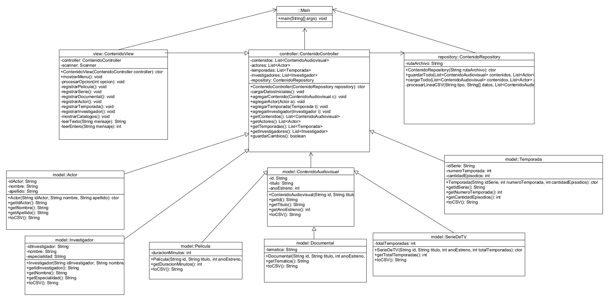

# Sistema de Gestión de Contenido Audiovisual 🎬

Este proyecto consiste en un sistema de gestión de contenidos audiovisuales desarrollado en **Java** bajo el patrón arquitectónico **MVC (Modelo-Vista-Controlador)** y aplicando principios de diseño **SOLID** (Responsabilidad Única, Abierto/Cerrado y Sustitución de Liskov). Los datos se persisten físicamente en un archivo de texto plano en formato **CSV**.

## 🚀 Cambios Realizados y Refactorización (SOLID)
* **Principio de Responsabilidad Única (SRP):** Se separó por completo la lógica de la interfaz de usuario (`ContenidoView`), el cerebro de las operaciones (`ContenidoController`), y la persistencia en disco duro (`ContenidoRepository`).
* **Principio Abierto/Cerrado (OCP):** La clase `ContenidoAudiovisual` se definió como abstracta. Agregar nuevos tipos de contenidos no requiere modificar el código existente, solo extender de ella.
* **Principio de Sustitución de Liskov (LSP):** Las subclases `Pelicula`, `SerieDeTV` y `Documental` pueden interactuar de forma transparente a través de la clase padre abstracta sin alterar el comportamiento esperado del sistema.

## 📁 Estructura del Código
El proyecto está organizado dentro de la carpeta `src/` bajo los siguientes paquetes de software:
* `view`: Contiene a `ContenidoView.java`, encargada del menú interactivo por consola.
* `controller`: Contiene a `ContenidoController.java`, que gestiona las colecciones en memoria.
* `repository`: Contiene a `ContenidoRepository.java`, encargado de leer y escribir el archivo CSV.
* `model`: Contiene la clase abstracta base `ContenidoAudiovisual.java` y sus clases hijas (`Pelicula.java`, `SerieDeTV.java`, `Documental.java`, `Actor.java`, `Temporada.java`, `Investigador.java`).

## 📊 Diagrama de Clases
A continuación se presenta la arquitectura del sistema diseñada en UMLet:



## 🛠️ Cómo Clonar y Ejecutar el Proyecto

### Prerrequisitos
* Tener instalado Java JDK 17 o superior.
* Un entorno de desarrollo como Eclipse IDE o NetBeans.

### Clonación:
Para clonar este repositorio de forma local, ejecuta el siguiente comando en tu terminal:
```bash
git clone [https://github.com/oscar2026-iure/SistemaGestionAudiovisual.git](https://github.com/oscar2026-iure/SistemaGestionAudiovisual.git)
